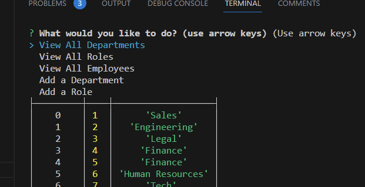

# Employee_tracker

 
## Description
This command line tool uses the NPM package ‘Inquirer 8.24’ to give the user options for viewing and updating a database. The database includes three tables that are linked to one another. 
 
   ## Table of Contents 
   - [Installation](#installation)
   - [usage](#usage)
   - [License](#license)
   - [Contributing](#contributing)
   - [Tests](#tests)
   - [Questions](#questions)
 

   ## Installation Instructions
   - node and inquirer 8.2.4
 

   ## Usage
   - Install correct packages needed.
   - Run node server.js
   - Select from a list of options to manage a company's database
  
  
   
   
   https://drive.google.com/file/d/1lZp4kcsQK0_u1_d0K5GErwRjtEOQSzZp/view
  

   
  

   ## Contributing
   Contributions are welcome. 
   Please submit a pull request at https://github.com/cjsolis12
 
   
   ## Tests
   Run the following command to run tests:
   ```
   node server.js
   ```
   
 
   ## Questions
   If you have any questions, please contact me using the following information:
 
   GitHub username: https://github.com/cjsolis12
 
   Email address: cjelizondo12@gmail.com
